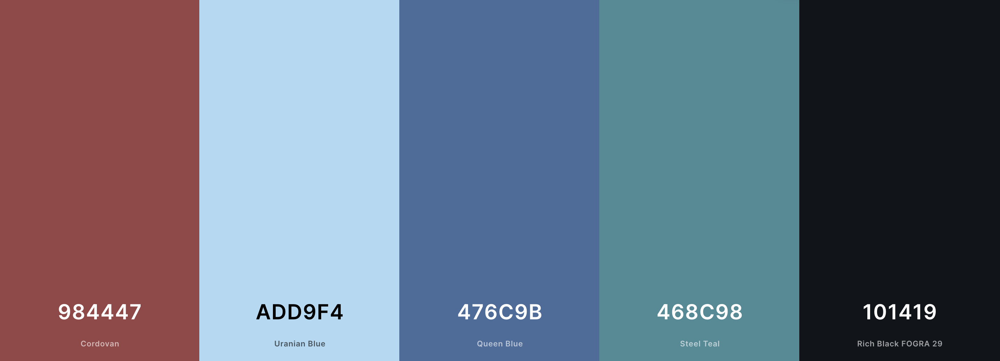
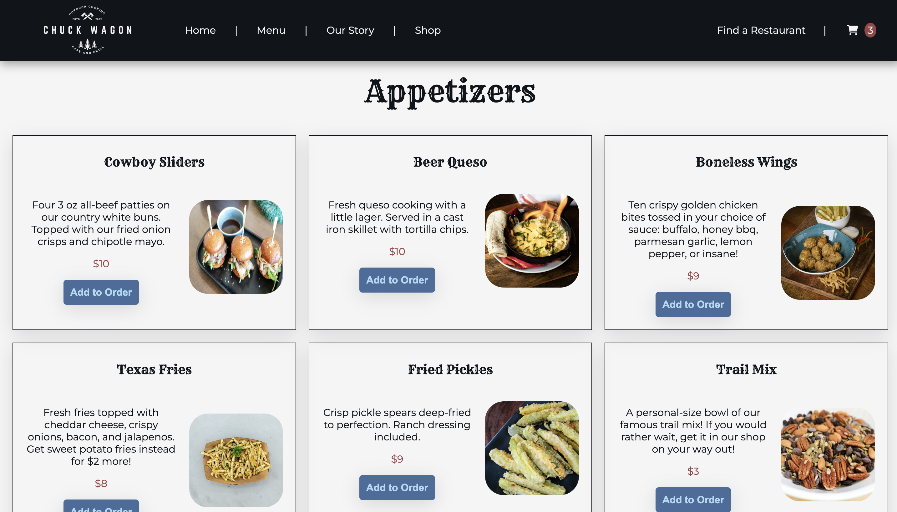
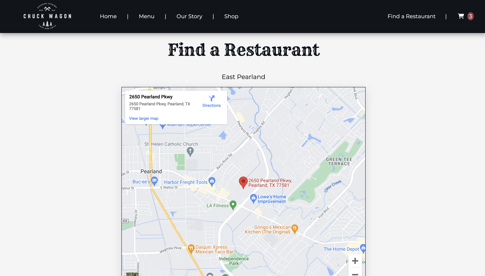
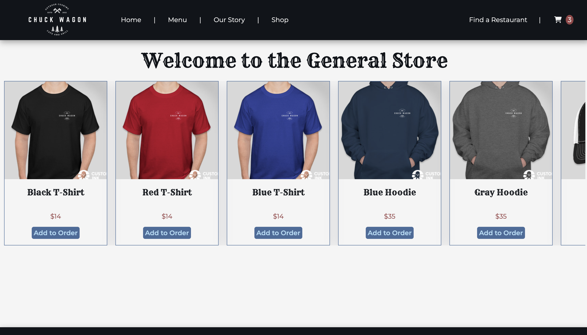
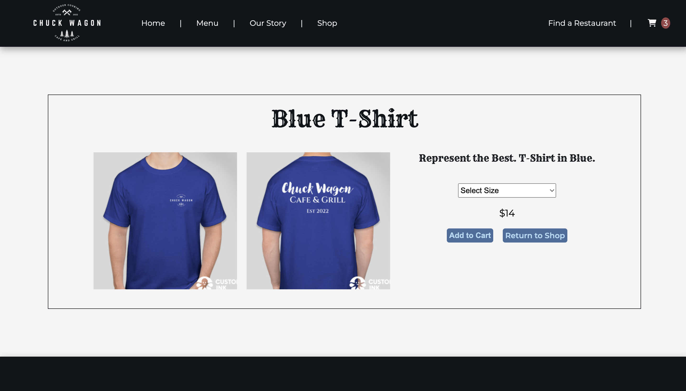
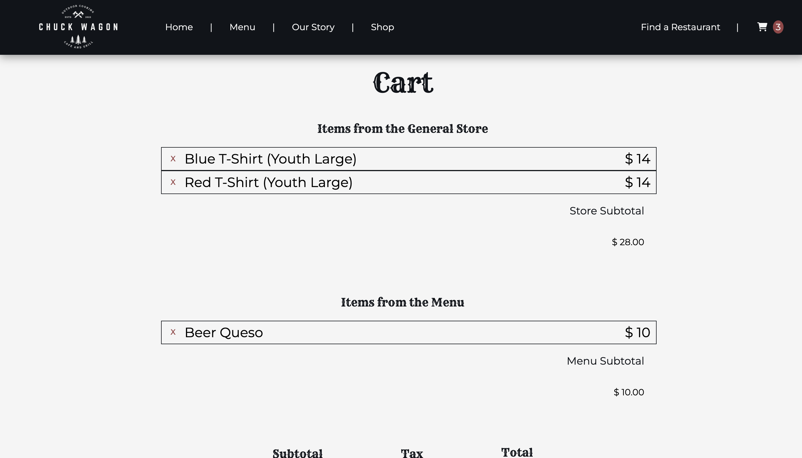
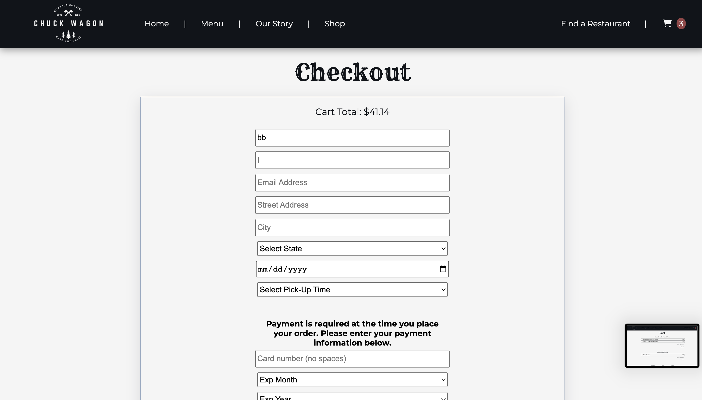
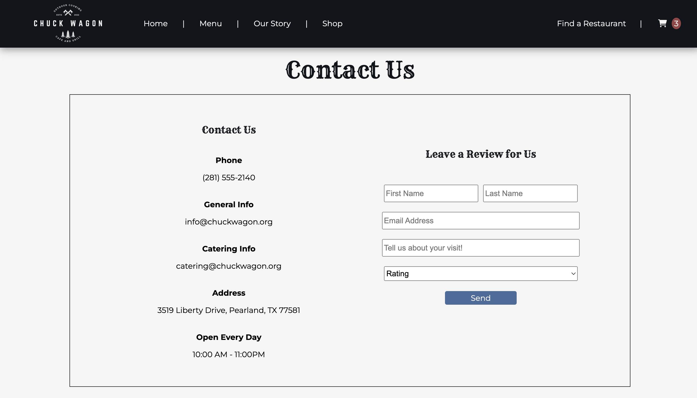

# **_Chuck Wagon_**

"The Chuck Wagon" is a website for a fictional restaurant. The purpose of this website is to showcase React as a front-end library for clean, practical applications.

---

## **Created By**

---

### Blake Lein

Published September 2022

[Email Me](blake.lein@gmail.com) | [GitHub](https://github.com/BlakeLein/ChuckWagon) | [LinkedIn](https://www.linkedin.com/in/blake-lein-bb6187238)

[You can view an article I wrote about the making of this project here](https://medium.com/@blake.lein/writing-a-restaurant-7b858196a2ee)

---

## **Requirements**

Chuck Wagon is deployed online, so all you need is this [link](https://charming-crepe-f11c6c.netlify.app/)

## How Chuck Wagon Works

---

### Wesbite Overview

"The Chuck Wagon" utilizes a front-end library consisting of React and Redux. Users can learn all about this hometown restaurant - what they sell, what they value, and how they operate. Users can also add menu or store items to their cart, check-out, and leave reviews for the owners to see. "The Chuck Wagon" is all about representing the passionate restaurant owner in a way that honors their hard work and dedication to bringing quality food to their customers.

---

### Website Features

Here are some of the website's features in greater detail:

- A clean and consistent modern design.
- Users can browse a full (fake) menu with pictures, descriptions, and prices.
- Users can browse a full e-commerce store with pictures, descriptions, and prices. Look out for the custom logo!
- Users can sign up for electronic updates, select and purchase menu items, and leave reviews for the owner.
- Fully resonsive on all media devices.

---

## Color Palette

Cordovan - #984447

Uranian Blue - #ADD9F4

Queen Blue - #476C9B

Steel Teal - #468C98

Rich Black FOGRA 29 - #101419

---

## The Chuck Wagon In Development

This website represents the fourth major project in our Digital Crafts coursework. "The Chuck Wagon" is intended to demonstrate a clear understanding of using React.js as a front-end framework. For demo purposes, all information is stored in redux-persist storage; however, the application can easily be converted into pulling and placing information into a database.

Here are some ways I would continue to develop "The Chuck Wagon":

- Hooking the website to a backend library for a more relevant storage solution.
- Hooking the website to a purchasing API to better simulate an online transaction.
- Creating a login function where users can maintain a profile along with an order history and a "favorites" page.

## Photos of Chuck Wagons

